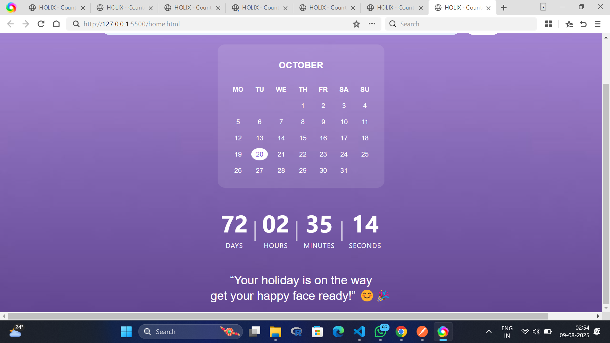
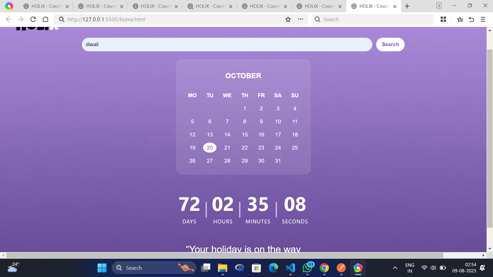
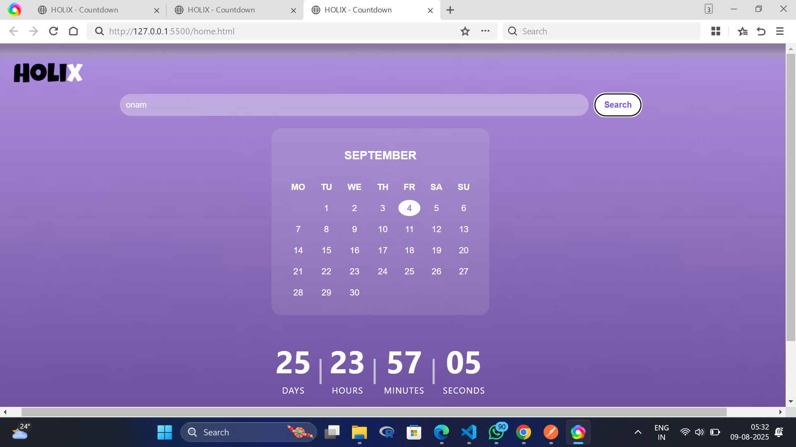

# Holix

## Basic Details
### Team Name: Shitt code

### Team Members
- Team Lead: muhsinakk- EMEA collage arts and science
- Member 2: nasrin c - EMEA collage arts and science

### Project Description
This tool helps you find the countdown to your favorite holidays quickly and visually. Simply type the name of a holiday in the search box, and the calendar for that holiday’s month will appear with the holiday date highlighted. You will also see how many days remain until that special day, along with a short description explaining the significance or meaning of the holiday. This way, you stay informed and excited about upcoming celebrations and important dates throughout the year

### The Problem (that doesn't exist)
Highlights the exact day on a calendar

### The Solution (that nobody asked for)
Shows a live countdown timer — updating days, hours, minutes, and seconds remaining until the holiday.

## Technical Details
### Technologies/Components Used
For Software:
Html
Css
Javascript

### Implementation
For Software:
# Installation
html

# Run
html

### Project Documentation
For Software:

# Screenshots (Add at least 3)

*Add caption explaining what this shows*

*Add caption explaining what this shows*

*Add caption explaining what this shows*

### Project Demo
# Video
[final](Holix.mp4)
*Explain what the video demonstrates*

# Additional Demos
[Add any extra demo materials/links]

## Team Contributions
- muhsina: suggest features and  add new holidays fix bugs 
- nasrin: improve ui
- [Name 3]: [Specific contributions]

---
Made with ❤️ at TinkerHub Useless Projects 

